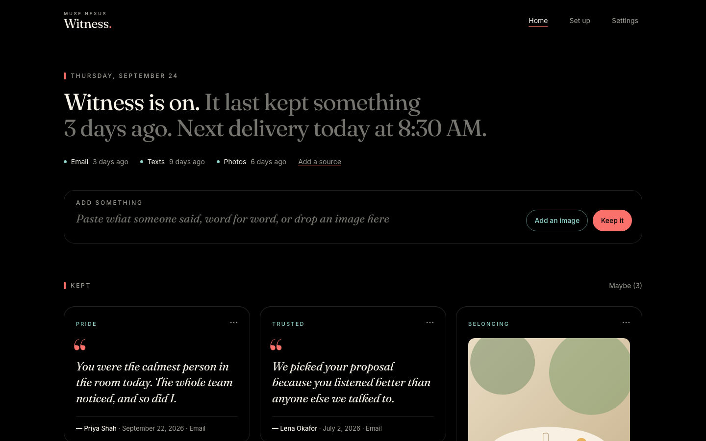

<p align="center"><sub><b>▍MUSE NEXUS</b></sub></p>
<h1 align="center">Witness.</h1>
<p align="center"><b>A witness to your life.</b></p>
<p align="center"><i>Witness quietly keeps the real things people say and do for you, and brings one back on the days you choose.</i></p>

---

## Why it exists

Some days your mind tells a story that isn't true. On those days you are
unlikely to open an app and go looking for proof.

Witness keeps the receipts for you: the kind text, the thank-you email, the
photo with someone who loves you. It keeps them in the other person's exact
words, with who said it and when. Then it brings one back on a rhythm you chose
while you were doing well.

## How it works

1. **Connect once.** Forward email, add an iPhone Shortcut, run the Mac helper,
   or connect an AI assistant. After that, nothing needs your attention.
2. **It keeps the real things.** A transparent detector saves clear evidence,
   verbatim. Anything uncertain waits quietly in a "maybe" pile.
3. **It comes to you.** One piece of evidence arrives by email on your rhythm.
   An assistant can offer one too, and shows it only after you say yes.
4. **It's yours.** Encrypted at rest, open source, self-hostable. Export or
   delete everything at any time.



## Status

v1 is in active development and not yet deployed.

| Part | Status |
|---|---|
| Hosted core (Cloudflare Worker, D1, R2) | in development |
| Web app | in development |
| Email capture (Gmail, Outlook, iCloud forwarding) | in development |
| iPhone Shortcut | in development |
| Witness for Mac (texts) | M1 in source: command line, build it yourself |
| AI assistants via MCP | in development |
| Text-message delivery, claude.ai connectors | planned |

See the [roadmap](ROADMAP.md) for what comes next.

## Quickstart

For development you need [Bun](https://bun.sh) 1.2.23 and
[Node.js](https://nodejs.org) 22 or later (Wrangler, which runs the Worker
locally, needs it).

```sh
git clone https://github.com/Muse-Nexus/proof-gallery.git witness
cd witness
bun install
bun run setup:dev   # once: a local key, MAILER=log and the local database
bun run dev         # then open http://localhost:8787
```

Sign-in links are printed in the terminal. Full deployment steps are in
[Self-hosting](docs/SELF_HOSTING.md). Guides for each source live in
[docs/guides](docs/guides/).

## Contribute

Witness is a mental-health support tool, so the product rules matter as much
as the code. Start with [Safety](docs/SAFETY.md), then
[Contributing](CONTRIBUTING.md) and the
[good first issues](docs/dev/good-first-issues.md). Use synthetic data only.

See also [Privacy](docs/PRIVACY.md), [Architecture](docs/ARCHITECTURE.md) and
[Security](SECURITY.md) for private vulnerability reports.

## If you are in crisis

Witness is not treatment and cannot help in an emergency. If you are in crisis,
call or text **988** in the US, or find a line near you at
[findahelpline.com](https://findahelpline.com).

## License

[MIT](LICENSE). Built by Muse Nexus (Mark Matthews) and contributors.
See [Notices](NOTICE.md).

<p align="center"><sub>Made by Muse Nexus in Hawaiʻi · Open source (MIT)</sub></p>
