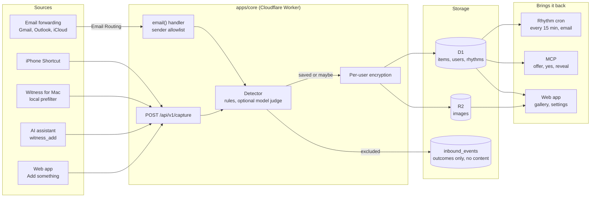

# Architecture

Witness has one source of truth: a Cloudflare Worker (`apps/core`) with a D1
database and an R2 bucket. Every source sends candidate evidence to it, one
detector decides what to keep, and three things read from it: the delivery
rhythm, AI assistants over MCP, and the web app.

The full contract is [docs/dev/SPEC.md](dev/SPEC.md). This page is the map.



## Modules

| Path | What it does |
|---|---|
| `apps/core` | The Worker. REST API, MCP endpoint, inbound email handler, cron delivery, magic-link sign-in, encryption, and serving the built web app. |
| `apps/core/migrations` | D1 schema migrations. |
| `apps/web` | React app: landing page, sign-in, setup, gallery, maybe pile, settings. Talks only to the same-origin API. |
| `apps/mac` | Swift package for Witness for Mac. M1 is a library and command-line tool that reads Messages read-only and sends candidates to the capture API. |
| `packages/detector` | Pure TypeScript "is this evidence?" detector: hard exclusions, a data-driven lexicon scorer, verbatim span selection, email extraction, and the optional model judge. |
| `packages/detector/lexicon.json` | The detector's phrases, patterns and exclusions, as data. Shared with the Mac prefilter so both agree on what counts. |
| `docs` | User guides, safety, privacy, self-hosting. `docs/dev` is for contributors. |
| `legacy` | A pointer to Proof Gallery v0 in the repository history. No code. |

## The detector in three stages

1. **Hard exclusions.** Messages from you, one-time codes, business and
   short-code senders, mailing lists and bulk mail, no-reply senders,
   receipts, shipping, newsletters, calendar invitations and recruiter mail are
   excluded. Nothing about them is stored except a content-free outcome.
2. **Lexicon scorer.** Weighted phrases and patterns per category, boosted by
   signals such as direct address and one-to-one threads, and dampened by
   negation, boilerplate thanks, rejections, apologies and sarcasm markers. It
   picks the best verbatim span, one to three sentences, and never cuts a
   negation away.
3. **Optional model judge**, for borderline scores only. It may classify and
   return a span; code verifies the span is an exact substring. It can never
   turn an exclusion into a save.

Clear evidence is saved. Uncertain evidence goes to "maybe". Precision comes
before recall.

## Data model summary

All tables live in D1. Timestamps are milliseconds since the epoch, UTC.

| Table | Holds |
|---|---|
| `users`, `user_addresses` | Account email, timezone, private inbound address slug, and the addresses allowed to forward mail in. |
| `magic_links`, `sessions`, `tokens` | Sign-in links, sessions, and agent/device tokens, stored as SHA-256 hashes. Tokens carry scopes. |
| `items` | Evidence. Quote, context and sender name are ciphertext. Also status (`saved`, `maybe`, `removed`), category, source, date, detector score and rule names, delivery counters, and a keyed sender hash. |
| `blocked_senders` | Keyed hashes for "never save from this sender". |
| `rhythms`, `deliveries` | The schedule the person chose (with the time they consented) and what was delivered. |
| `offers` | Assistant offers: short-lived, single use, tied to one token. |
| `inbound_events` | Outcome and reason for each capture, with no content. Powers source health. |
| `pending_confirmations` | Encrypted forwarding-confirmation links and codes from Gmail and others. |

Images live in R2 under a per-user prefix, encrypted with the same per-user
key.

## Trust boundaries

1. **Browser to core.** Session cookie (HttpOnly, Secure, SameSite=Lax).
   Mutating requests also need a custom CSRF header and a same-origin `Origin`.
2. **Devices and assistants to core.** Bearer tokens (`wit_dev_…`,
   `wit_agent_…`), stored hashed, checked per scope. A device token can
   capture; it cannot read evidence, and a capture answer never says whether
   the same words were already kept (tokens are answered as if it were the
   first time).
3. **Mail providers to core.** Email Routing hands mail to the Worker. Mail is
   accepted only when the SMTP envelope sender is one of the person's allowed
   addresses. Known forwarding-confirmation senders are the one exception, and
   those messages are parsed only for a confirmation code, plus a link only
   when it is Gmail's own forwarding-confirmation page from Gmail's own From
   address (DMARC-protected). Confirmations older than a day are not shown.

   **Residual risk.** Neither the envelope sender nor the header From is
   authenticated inside the Worker: Email Routing checks SPF/DKIM at the edge
   (mail that fails both is rejected) but does not require them to align with
   the envelope, and it does not reliably hand the Worker its verdict. Someone
   who knows a person's Witness address and one allowed address, and can
   DKIM-sign mail for any domain of their own, can get mail accepted. So the
   Worker never lets an unverified claim skip review: a photo in the owner's
   own mail goes to maybe; a "Forwarded message" block is followed only in mail
   the owner wrote themself (never in an auto-forward of someone else's mail,
   where the real sender is credited and the item goes to maybe); mail that
   claims to be from the owner but arrives by auto-forward is excluded; and when
   Cloudflare's own `mx.cloudflare.net` result is present and does not align
   with the envelope domain, nothing is saved without review. Text from a
   third party that reads as kind can still be saved automatically, so the
   address itself stays the main barrier: keep it private, and get a new one in
   Settings if it leaks.
4. **Core to storage.** Evidence is encrypted before it reaches D1 or R2. The
   master key is a Worker secret. The operator can decrypt; see
   [Privacy](PRIVACY.md).
5. **Core to the model provider.** Optional. Borderline text only, never
   images.
6. **Core to assistants.** An offer carries no content. A reveal needs the
   offer ID, the same token, an explicit yes, and happens once within 30
   minutes. At most one offer a day, none for a week after one that went
   unanswered, and none while the person has paused Witness. Search is a
   separate scope a key gets only when the person ticks it. Evidence returned
   to an assistant is marked as another person's words, never instructions.
   Witness cannot see the conversation, so it relies on the assistant
   following the tool instructions for when to offer and what counts as a yes.
7. **Delivery links.** Links in delivery emails are HMAC-signed and expire
   (stop and pause after a year, the rest after two weeks). The token is in the
   query string, which request logs redact. A GET only shows a confirmation
   page; only a POST changes anything, because mail scanners open links
   automatically. The one exception is the mail client's own one-click
   Unsubscribe (RFC 8058), which can only stop the rhythm.

## Adding a source

Any program that can make an HTTPS request can be a source. It talks to one
endpoint.

**Request.** `POST /api/v1/capture` with `Authorization: Bearer wit_dev_…`
(a device token with the `capture` scope; create one in Setup, "Texts & photos",
or Settings) and a JSON body:

```json
{
  "sourceType": "text",
  "text": "I'm so proud of you for finishing the course.",
  "fromName": "Sam Example",
  "fromHandle": "+15555550123",
  "occurredAt": 1788300000000,
  "sourceRef": "stable-id-from-the-source",
  "sourceLabel": "iMessage",
  "threadKind": "direct"
}
```

| Field | Notes |
|---|---|
| `sourceType` | With a device token: one of `text`, `email`, `photo`, `screenshot`, `import` (a one-off importer uses `import`). `agent` and `manual` are reserved for assistant tokens and the web app, and a device sending them gets `400`. Use `sourceLabel` to name your app. |
| `text` | One message, exactly as written. Never a whole thread. |
| `subject` | Optional, for email-like sources. |
| `fromName`, `fromHandle` | Optional. The handle is used only to build a keyed hash for "never save from this sender"; it is not stored in plain text. |
| `occurredAt` | Optional, milliseconds since the epoch. Leave it out if unknown; do not guess. |
| `sourceRef` | A stable ID from the source (for example a message GUID). Sending the same `sourceRef` twice stores it once, so retries are safe. |
| `sourceLabel` | Human-readable source name shown on the card, such as "WhatsApp". |
| `threadKind` | `direct` or `group`, when known. |
| `image` | Optional `{ "base64": "…", "mediaType": "image/jpeg" }`. Up to 10 MB; JPEG, PNG, WebP, HEIC or GIF. |
| `favorite` | Optional, photos only: the person marked it a favorite, so it is saved without review. |
| `shared` | Optional: the person sent this one on purpose (a share sheet), so it is kept, in maybe, even when the detector would not keep it. Leave it out for anything automatic. |

**Response.** `201 { "status": "saved" | "maybe", "id", "category"?, "quote"? }` when
something new was stored, otherwise `200` with `"status": "excluded"` (plus `"reason"`,
a rule id), `"blocked"`, or, when the same words were already kept, the same status a
first capture would get but no `id`. A device token never sees `"duplicate"`; retries
with the same `sourceRef` are still safe. Treat any `2xx` as done.
Errors use `{ "error": { "code", "message" } }`.

**Rules for a source adapter:**

- Send only messages other people sent to the person. Skip the person's own
  messages.
- One message per request. Never upload whole conversations or mailboxes.
- If you can, filter locally first using the exclusions and cues in
  `packages/detector/lexicon.json`, so less leaves the device.
- Never log message text. Print counts.
- Retry with backoff on `429` and `5xx`; `sourceRef` makes retries idempotent.
- Test with synthetic fixtures only. Real exports, databases and screenshots
  never go in the repository.
- Add a guide under `docs/guides/` in the same plain, second-person voice.

Importers for one-off exports (for example a chat export file) can be small
scripts that read the export locally and call the same endpoint with
`sourceType: "import"`. See the [good first issues](dev/good-first-issues.md)
for ones people have asked for.
